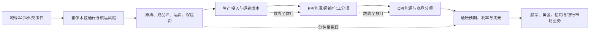

# 7月14—15日交叉窗口：CPI/PPI × 银行财报 × 美伊冲突

> [!summary] 当前结论（截至 2026-07-15 09:52 北京时间 / 2026-07-14 21:52 美东时间）
> - **H1：原假设不成立，且存在时间错配。** 6月CPI能源分项环比下降5.7%，显著低于5月的上涨3.9%；但6月CPI不能用于检验7月新增冲突对价格的即时影响。
> - **H2：部分支持，因果关系未证实。** 多家银行市场业务表现强，但摩根大通大宗商品收入反而下降，官方财报也未把交易收入增长直接归因于美伊冲突。
> - **H3：证据不足。** 尚未完成地缘事件、数据发布与资产价格的分钟级对时，不能判断“叠加冲击”及其滞后性。
> - 6月PPI、贝莱德与摩根士丹利Q2结果尚未到官方发布时间，保持 `pending`，不提前填数。

> [!warning] 使用边界
> 本条目用于宏观推导与微观传导研究，不构成交易指令。未经官方来源确认的具体战况、伤亡、打击次数和人物变动不进入正式结论。

关联：[[提醒系统_2026下半年关键事件]] · [[AI项目控制台/financial-alert-system/04_研究工作台/02_执行与验收/研究工作台整改执行报告_2026-07-12]]

## 一、修正后的事件日历

| 日期（美东时间） | 事件 | 当前状态 | 修正说明 |
|---|---|---|---|
| 7月14日 08:30 | 6月CPI | **已发布、已核验** | BLS官方发布 |
| 7月14日盘前 | 摩根大通、富国银行、花旗、美国银行Q2财报 | **已发布、已核验** | 原笔记把美国银行误列到7月15日 |
| 7月15日 07:30前后 | 贝莱德、摩根士丹利Q2财报/电话会 | **待发布** | 原笔记把贝莱德误列到7月14日 |
| 7月15日 08:30 | 6月PPI | **待发布** | 截止核验时，BLS最新仍为5月数据 |
| 7月30日 | 6月PCE价格指数 | **后续观察点** | 非本次首次回填核心 |

## 二、宏观数据回填

### 1. 6月CPI：能源冲击在6月明显回落

| 指标 | 5月 | 6月实际 | 方向 |
|---|---:|---:|---|
| CPI环比（季调） | +0.5% | **-0.4%** | 明显降温 |
| CPI同比（未季调） | +4.2% | **+3.5%** | 回落 |
| 核心CPI环比 | +0.2% | **0.0%** | 降温 |
| 核心CPI同比 | +2.9% | **+2.6%** | 回落 |
| 能源环比 | +3.9% | **-5.7%** | 方向反转 |
| 汽油环比 | +7.0% | **-9.7%** | 主要拖累项 |
| 食品环比 | +0.2% | **+0.2%** | 持平 |

解释：6月能源指数创2020年4月以来最大单月降幅，汽油是主要驱动。该结果直接否定“6月CPI能源分项高于5月”的数值判断，但不能据此证明7月地缘风险已经消失。

### 2. 6月PPI：尚未发布，不提前下结论

- BLS官方5月基准：最终需求PPI环比 **+1.1%**、同比 **+6.5%**；最终需求商品 **+2.8%**，其中能源 **+10.7%**；最终需求服务 **+0.3%**，运输与仓储服务 **+2.6%**。
- 原笔记的“5.10% vs 3.40%”来自不同非官方口径，已停止使用；正式基准统一为BLS最终需求PPI。
- 6月PPI计划于 **2026-07-15 08:30 ET** 发布。发布前保留为 `pending`。

### 3. 方法论修正：发布日期不等于数据发生期

6月CPI/PPI反映的是6月价格环境。若要检验7月6日以后新增海峡风险或军事行动对美国物价的影响，应使用：

1. 高频层：WTI/Brent、美国零售汽油、航运费率与保险费；
2. 生产层：7月PPI（8月发布）及能源、运输、化工等分项；
3. 消费层：7月CPI（BLS计划于8月12日发布）；
4. 金融层：收益率、美元、黄金、股指及银行交易业务的事件窗口反应。

因此，本样本能验证“6月能源价格是否继续上行”，不能直接验证“7月冲突是否已进入6月CPI/PPI”。

## 三、7月14日金融机构财报回填

| 机构 | Q2核心结果 | 市场业务观察 | 对H2的含义 |
|---|---|---|---|
| 摩根大通 | 净利润212亿美元；摊薄EPS 7.70美元；剔除重大项目后净利润169亿美元、EPS 6.14美元 | Markets收入121亿美元，同比+35%；FICC 61亿美元，同比+6%；Equities 60亿美元，同比+86%；**大宗商品收入下降** | 市场活跃度强，但不支持“商品收入必然受益” |
| 富国银行 | 净利润64.07亿美元；EPS 2.00美元；营收226.22亿美元 | Markets收入同比+24% | 支持市场活动增强，但没有地缘归因 |
| 花旗 | 净利润58亿美元；EPS 3.15美元；营收248亿美元 | 官方材料提到外汇、利差产品强，Equities收入同比+45% | 支持部分交易条线走强，仍不能锁定冲突因果 |
| 美国银行 | 净利润91亿美元；EPS 1.21美元；营收316亿美元 | 官方演示材料显示销售与交易收入约71亿美元，FICC约35亿美元、Equities约36亿美元 | 市场业务强，但需区分股票、信用、利率、商品贡献 |

### H2判定：部分支持，因果关系未证实

可以确认的是：二季度多家银行交易与市场业务同比增长，反映客户活动和市场波动较强。

不能确认的是：这些增长由7月美伊冲突驱动。财报覆盖整个二季度，而7月事件发生在季度结束后；同时，摩根大通明确显示大宗商品收入下降。当前证据更支持“广义市场活动增强”，不支持“地缘冲击已经通过大宗商品交易收入被直接定价”的强结论。

## 四、地缘—能源链条：已确认事实与隔离信息

### 已由官方来源确认

- CENTCOM资料显示，美军“Operation Epic Fury”于2026年2月28日开始。
- 白宫资料显示，美国与伊朗于6月17—18日签署谅解备忘录，内容包括停止军事行动与恢复霍尔木兹海峡通行。
- EIA 7月7日判断：海峡通行增加后，全球原油生产和贸易流将逐步恢复；6月Brent现货均价约85美元/桶，较5月低22美元/桶；EIA预计2026年下半年美国零售汽油均价约3.60美元/加仑。
- EIA周度数据同时显示，美国全品类汽油均价从7月6日的3.911美元/加仑升至7月13日的3.987美元/加仑。该周度回升发生在7月，不能与6月CPI汽油环比下降9.7%混为同一观察期。
- 美国海事管理局当前仍把波斯湾、霍尔木兹海峡和阿曼湾商业航运风险列为高位，说明“通行恢复”与“安全风险完全消失”并非同一命题。

### 暂不进入结论的原始叙事

原笔记中关于7月7—11日具体打击次数、目标数量、商船事件因果、地区基地遇袭、外交通话细节及伊朗最高领袖变动的表述，本轮未取得足够的一手来源交叉确认。上述内容保留为待核线索，不作为H1—H3判定依据。

## 五、假设验收矩阵

| 假设 | 当前状态 | 证据 | 判定 |
|---|---|---|---|
| H1：海峡恶化使CPI能源高于5月、PPI同步承压 | **未通过 / 设计需修正** | 6月CPI能源-5.7%，低于5月+3.9%；6月PPI待发布；7月事件与6月数据时间错配 | 原H1不成立，改测7月高频能源、7月PPI/CPI |
| H2：银行FICC/商品收入显著受益于地缘波动 | **部分支持** | 多家Markets业务增长，但JPM商品收入下降，且财报期与7月事件错配 | 只能确认市场活动强，不能确认地缘—商品因果 |
| H3：数据发布期叠加地缘冲击造成滞后反应 | **待验证** | 尚缺分钟级事件时间戳和跨资产路径 | 需建立事件回放后再判定 |

## 六、修订后的微观传导链

研究时必须同时记录“方向、强度、时滞、反证”：

| 传导段 | 首选数据 | 典型时滞 | 主要反证 |
|---|---|---|---|
| 事件→市场价格 | Brent/WTI、黄金、美元、2Y/10Y收益率 | 分钟—数日 | 外交缓和、库存与供给对冲 |
| 海峡→实体成本 | 航运量、运费、保险、零售汽油 | 数日—数周 | 通行恢复、替代路线、库存释放 |
| 成本→PPI | 能源、运输、化工、金属分项 | 数周—数月 | 企业吸收成本、需求走弱 |
| PPI→CPI | 汽油、商品、运输与服务 | 1—6个月 | 利润率压缩、权重与统计滞后 |
| 波动→银行收入 | FICC、Equities、客户活动、VaR | 当季—下一季 | 方向错配、对冲损失、业务结构差异 |

## 七、下一轮回填清单

- [x] 回填6月CPI及能源/核心分项
- [x] 纠正美国银行、贝莱德财报日期
- [x] 回填摩根大通、富国、花旗、美国银行Q2核心结果
- [x] 统一5月PPI官方基准，废止“5.10% vs 3.40%”混合口径
- [x] 用白宫、CENTCOM、EIA、MARAD替换未核实的二手地缘叙事
- [ ] 7月15日08:30 ET后回填6月PPI及能源、运输、化工分项
- [ ] 回填贝莱德与摩根士丹利Q2结果
- [ ] 建立CPI/PPI发布前5分钟、后5/30分钟及收盘的DXY、2Y、10Y、Brent/WTI、黄金、标普500、银行指数快照
- [ ] 为7月地缘风险建立独立事件钟；使用7月高频价格、7月PPI和7月CPI进行真正的时滞检验
- [ ] 7月30日回填6月PCE并与CPI/PPI完成三层对照

## 八、官方来源

### 宏观数据

- [BLS：2026年6月CPI新闻稿](https://www.bls.gov/news.release/cpi.htm)
- [BLS：PPI主页与最新数据](https://www.bls.gov/ppi/)
- [BLS：2026年发布日历](https://www.bls.gov/schedule/2026/)

### 公司财报

- [JPMorgan Chase：2026年Q2财报材料](https://www.jpmorganchase.com/content/dam/jpmc/jpmorgan-chase-and-co/investor-relations/documents/quarterly-earnings/2026/2nd-quarter/6cded9fd-a164-4e6c-8cff-377357cf105c.pdf)
- [Wells Fargo：2026年Q2财报材料](https://www.wellsfargo.com/assets/pdf/about/investor-relations/earnings/second-quarter-2026-earnings.pdf)
- [Citigroup：2026年Q2财报材料](https://www.citigroup.com/rcs/citigpa/storage/public/Earnings/Q22026/2026prqtr2rslt.pdf)
- [Bank of America：2026年Q2官方结果中心](https://investor.bankofamerica.com/)
- [BlackRock：2026年Q2财报发布时间公告](https://ir.blackrock.com/news-and-events/press-releases/press-releases-details/2026/BlackRock-to-Report-Second-Quarter-2026-Earnings-on-July-15th/default.aspx)
- [Morgan Stanley：2026年Q2电话会与发布时间](https://www.morganstanley.com/about-us-ir/morgan-stanley-second-quarter-2026-investor-conference-call)

### 地缘与能源

- [CENTCOM：Operation Epic Fury事实表](https://www.centcom.mil/Portals/6/Documents/Publications/260401-Fact%20Sheet.pdf)
- [白宫：美伊谅解备忘录](https://www.whitehouse.gov/videos/president-trump-signs-iran-memorandum-of-understanding/)
- [EIA：海峡恢复通行后的2026年7月能源展望](https://www.eia.gov/pressroom/releases/press590.php)
- [EIA：美国零售汽油周度价格](https://www.eia.gov/dnav/pet/pet_pri_gnd_a_epm0_pte_dpgal_w.htm)
- [MARAD：波斯湾、霍尔木兹海峡和阿曼湾商业航运风险公告](https://www.maritime.dot.gov/msci/2026-004-persian-gulf-strait-hormuz-and-gulf-oman-iranian-attacks-commercial-vessels)

---

最后核验：2026-07-15 09:52（北京时间）。下一次强制更新点：2026-07-15 08:30（美东时间）之后。
