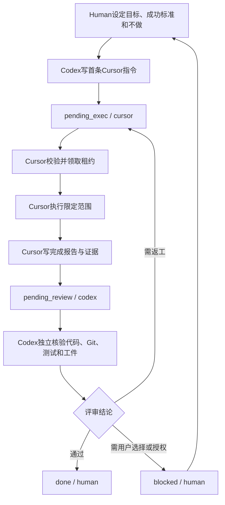

# Cursor ↔ Codex 阶段闭环：使用方法、功能与主要流程

> [!warning] 当前状态：待使用功能
> 闭环交接板、Cursor规则、Codex规则、镜像校验和并发租约机制已经建立，并已通过工具级正向/负向测试；但尚未完成一次真实项目任务的`Cursor执行 → Codex评审 → Cursor返工/完成 → done`全过程。
>
> 因此本功能当前只能标记为：**机制就绪，待首次真实使用验证**，不得写成“已正式投入使用”或“闭环已验证”。

## 一、功能目的

本功能用于解决Cursor与Codex协作时常见的四类问题：

1. Cursor完成代码后，Codex不知道具体改了什么；
2. Codex提出问题后，Cursor继续自由扩展而没有严格返工边界；
3. 任务状态散落在聊天中，切换会话后容易失真；
4. 两个AI或多个窗口同时执行，造成重复修改、范围膨胀或覆盖。

核心做法是：

> 以Obsidian交接板作为唯一共享回合状态；Cursor负责执行，Codex负责独立评审，Human负责启动、改向、授权与解阻。

聊天仍然是用户控制面。当前用户明确指令始终高于交接板，交接板高于历史文档和旧聊天。

## 二、主要功能

| 功能 | 作用 |
|---|---|
| 单一交接板 | 统一保存目标、下一条指令、Cursor报告、Codex反馈和回合历史 |
| 角色分离 | Cursor执行；Codex独立核验；Human启动和处理关键选择 |
| 状态机 | 用`idle / pending_exec / pending_review / blocked / done`控制下一位执行者 |
| 正本与镜像校验 | Obsidian为正本，仓库保存安全镜像；内容不一致时停止执行 |
| 并发租约 | 一个回合只允许一个Cursor或Codex会话领取，防止并行覆盖 |
| 证据锚点 | 记录Git前后HEAD、工作树范围、验证退出码、工件路径和SHA-256 |
| 范围控制 | 每条指令必须写清允许改动路径、成功标准、明确不做和截止条件 |
| 人工解阻 | 需要付费、授权、改变目标或超过最大回合时交还Human |
| 安全边界 | 禁止把密钥、`.env`、付费原文和授权原始行情写入交接板或仓库镜像 |

## 三、组成文件

### Obsidian正本

`F:\AI 金融知识点\AI协作记忆系统\Cursor_Codex_闭环交接板.md`

用途：保存当前唯一回合状态，Human、Cursor和Codex都以此为准。

### 仓库镜像

`F:\financial-alert-system\docs\ai-collab\Cursor_Codex_闭环交接板.md`

用途：让代码仓库中的AI能够读取同一状态；只允许保存安全摘要、路径、任务ID和哈希。

### Cursor规则与权限

- `F:\financial-alert-system\.cursor\rules\cursor-codex-obsidian-loop.mdc`
- `F:\financial-alert-system\.cursor\permissions.json`

用途：约束Cursor只在轮到自己时执行，只写允许范围，并在完成后交给Codex。

### Codex规则

`F:\financial-alert-system\AGENTS.md`

用途：约束Codex只在`pending_review`时接板，独立检查代码与证据，不把Cursor报告直接当作通过结论。

### 同步与租约工具

`F:\financial-alert-system\scripts\ai_collab_board.js`

用途：校验正本与镜像、领取/释放租约、阻断错误状态和同步镜像。

## 四、状态含义

| status | next_actor | 用户应做什么 |
|---|---|---|
| `idle` | `human` | 设置目标，决定是否启动新闭环 |
| `pending_exec` | `cursor` | 打开Cursor，让它执行交接板第3节 |
| `pending_review` | `codex` | 回到Codex，让它独立评审 |
| `blocked` | `human` | 用户处理选择、授权、数据源或范围变更 |
| `done` | `human` | 用户确认完成，决定归档或开启下一循环 |

合法组合是固定的。状态与`next_actor`不匹配时，校验工具必须失败。

## 五、用户最简操作方法

用户不需要手工修改frontmatter或运行命令，只需在Cursor与Codex之间按状态切换。

### 第一步：让Codex建立本轮任务

在Codex中说明：

```text
启动闭环。

目标：<本轮只完成什么>
成功标准：<什么证据出现才算完成>
明确不做：<本轮禁止扩展的内容>
```

Codex负责：

- 填交接板第1节任务目标；
- 写第3节首条Cursor指令；
- 设置`status=pending_exec`、`next_actor=cursor`；
- 同步Obsidian正本与仓库镜像。

### 第二步：让Cursor执行

在Cursor中输入：

```text
执行Cursor_Codex闭环交接板当前指令。
```

Cursor负责：

- 校验正本与镜像；
- 领取唯一租约；
- 只执行第3节允许范围；
- 写第4节完成报告和第6节历史；
- 设置`status=pending_review`、`next_actor=codex`；
- 释放租约并停止，不继续顺手扩展。

### 第三步：让Codex独立评审

回到Codex输入：

```text
评审闭环交接板。
```

Codex必须独立检查：

- 实际Git改动和工作树范围；
- Cursor是否越出允许路径；
- 测试命令与真实退出码；
- 研究/工程工件及SHA-256；
- Cursor报告与代码、工件是否一致。

Codex评审后只能选择：

```text
通过    → done / human
需返工  → pending_exec / cursor
需决策  → blocked / human
```

### 第四步：需要返工时再交Cursor

在Cursor中输入：

```text
继续执行交接板中的新指令。
```

Cursor只处理Codex列出的返工项。完成后再次交Codex评审，直到`done`或`blocked`。

## 六、主要流程



## 七、异常处理

### 正本与镜像不一致

现象：工具报告`mirror_mismatch`。

用户对Codex说：

```text
修复闭环交接板同步。
```

在同步完成前，Cursor和Codex都不得继续业务任务。

### 有未过期租约

说明另一会话正在执行。不要同时开第二个Cursor/Codex窗口抢同一任务，等待原会话写回或租约到期。

### 租约过期

用户对Codex说：

```text
检查并接管过期闭环租约。
```

新会话接管后必须先检查Git和现场状态，不能假设旧会话什么都没改。

### 用户改变任务目标

当前用户指令优先。旧闭环应先转为`blocked / human`并记录改向原因，不得在同一`loop_id`中静默偷换目标。

### 达到最大回合仍未完成

当`turn >= max_turns`时必须转`blocked / human`，由用户决定继续、缩小范围、改变方案或停止。

## 八、首次真实验证建议

建议用一个边界明确、已有证据管线的任务作为第一次真实闭环：

```text
目标：完成nfp_2026_01的证据采集、研究门禁和人工审计。
成功标准：AUDIT_PASS，或者留下可复核、不可伪装的BLOCK原因。
明确不做：不推进下一场、不降低研究门禁、不开发其他模块。
```

首次真实验证重点不是追求`AUDIT_PASS`，而是验证：

1. Cursor是否严格停在指令边界；
2. Codex是否能够发现报告和实际证据之间的差异；
3. 返工指令是否足够具体；
4. 正本、镜像、Git和工件是否始终一致；
5. 最终是否能够从`pending_exec`走到`done`或诚实的`blocked`。

## 九、从“待使用”升级的条件

只有同时满足以下条件，才允许把本功能状态从“待使用功能”改为“已验证可用”：

- [ ] 至少完成一次真实Cursor执行回合
- [ ] 至少完成一次Codex独立评审
- [ ] 如有问题，至少完成一次Cursor定向返工
- [ ] 最终到达`done`或证据充分的`blocked`
- [ ] 全程没有正本/镜像漂移
- [ ] 租约正确阻止并发执行
- [ ] Git、命令退出码和工件哈希能够复原
- [ ] 没有范围外改动和敏感信息进入镜像
- [ ] 用户确认操作成本低于直接在聊天中传递任务

若首次真实任务没有走完以上流程，本功能继续保持“待使用功能”，只修机制，不宣布闭环成立。

## 十、关联

- [[AI协作记忆系统/Cursor_Codex_闭环交接板]]
- [[AI协作记忆系统/00_AI记忆入口]]
- [[AI协作记忆系统/AI记录规范]]
- [[AI协作记忆系统/会话交接日志]]
- [[AI项目控制台/项目_financial-alert-system]]

