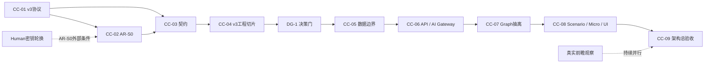

# Cursor ↔ Codex 阶段闭环执行计划：现阶段至架构改造完成

> [!important] 计划定位
> 本计划把 Model v2 失败基准、Model/Gate v3、AR-S0 收尾和 AR-S1～AR-S3 架构改造拆成独立的 Cursor → Codex 闭环。
>
> Cursor负责执行；Codex负责独立评审；Human负责启动、改向、授权和解阻。任何阶段都不得自动跳到下一阶段。

执行方法：[[AI协作记忆系统/Cursor_Codex_阶段闭环使用方法与主要流程|Cursor–Codex 阶段闭环使用方法]]  
唯一交接板：[[AI协作记忆系统/Cursor_Codex_闭环交接板|Cursor–Codex 闭环交接板]]  
架构基线：[[AI项目控制台/financial-alert-system/01_项目治理/02_工程与文档/当前架构演进规划_V1.1_2026-07-18|当前架构演进规划 V1.1]]

---

## 一、当前权威基线

### 研究状态

```text
gate_eligible = 20
audit_pass = 20
research_counted = 20
```

- Model v2 已冻结为真实失败基准；
- Gate v2 保持 `BLOCK`；
- direction accuracy：32%；
- mean multiclass Brier：0.7423；
- delta vs best baseline：-0.0471；
- graph delta：0；
- 禁止修改冻结卡、降低门槛或用同一20卡重新宣称研究通过。

权威工件：

```text
artifacts/nfp_model_v2_failure_baseline_freeze.json
artifacts/nfp_gate_v2_gap_diagnosis.json
artifacts/nfp_gate_v2_gap_report.md
artifacts/nfp_model_gate_v3_preregistration.json
artifacts/nfp_research_counts.json
artifacts/nfp_research_blind_gate_v2.json
```

### AR-S0状态

- 浏览器侧硬编码文件已改为 no-op；
- 外部 DeepSeek 密钥轮换由Human在供应商控制台完成；
- Git历史扫描待完成；
- 临时目录只允许分类，不允许盲删；
- 基线、ADR、版本血缘已建立；
- 真实前瞻继续观察。

权威工件：`artifacts/ar_s0_checklist.json`、`artifacts/nfp_version_lineage_v1.json`。

### 工程现场

- 正式源码：`F:\financial-alert-system`；
- 主线 tip（2026-07-23 治理同步）：`897853b`（已 push `origin/master`）；
- CC-03 / CC-04 / DG-1 / CC-05 已在主线完成；当前阶段 **CC-06 / AR-S2**；
- Cursor每轮必须记录开始前工作树，不得把既有改动误算为本轮成果；
- 默认不得提交、推送、重写历史或删除目录，除非当前交接板明确授权；
- Salary orphan `integration/salary-commission` @ `8db521e` **不**合入 FAS master。

### 阶段完成状态（2026-07-23 同步）

| 阶段 | 状态 | 说明 |
|---|---|---|
| CC-01 | done | v3 协议可实现候选已冻结 |
| CC-02 | done / residual | AR-S0 本地可控项完成；外部密钥轮换等残留不阻断 CC-06 |
| CC-03 | done | AR-S1A `packages/contracts` 统一契约 |
| CC-04 | done | v3 纯函数切片 + Codex PASS（无研究信用） |
| DG-1 | done | 允许进入 CC-05 / 主线接线 |
| CC-05 | done | v3 主线接线（默认 disarm）+ 已发布 `897853b` |
| **CC-06** | **done** | AR-S2 API + AI Gateway PASS @ `d1501e7`（refs disarm） |
| **CC-07A** | **active** | 服务端可信 Context Pack + Evidence/Graph/Path 只读登记与引用真实性（AI refs 仍 disarm） |
| CC-07 | pending | AR-S3A Graph 领域抽离（待 CC-07A） |
| CC-08～CC-09 | pending | 待前序完成 |

---

## 二、本计划边界

### 完成线

本计划只在以下条件同时满足时结束：

1. Model/Gate v3 输入、输出、评分和数据隔离协议冻结；
2. AR-S0 完成或对外部阻塞留下诚实的 `blocked`；
3. AR-S1 统一契约与数据边界完成；
4. AR-S2 后端 API 与 AI Gateway 完成；
5. AR-S3 Graph、Scenario、Micro 领域能力完成渐进抽离；
6. 遗留界面通过兼容适配器继续工作；
7. 架构验收、回滚和状态生成器通过；
8. 架构完成不自动升级研究等级。

### 明确不包括

- 不要求在架构完成前取得 `RESEARCH_PASS`；
- 不包含 Historical Similarity、Alert Ranking、AI Analyst；
- 不包含多用户、自动交易、上云发布；
- 不全面更换前端框架；
- 不引入DuckDB、图数据库或平行V2仓库；
- 不处理与本阶段无关的横向功能扩张。

以上属于AR-S4及以后阶段，需另开计划和新闭环。

---

## 三、闭环执行规则

### 一个阶段一个闭环

```text
Codex/Human建立任务
  → pending_exec / cursor
  → Cursor领取租约并执行
  → pending_review / codex
  → Codex独立评审
  → done / pending_exec / blocked
```

- 前一阶段未到 `done` 或证据充分的 `blocked`，不得开启下一阶段；
- 每阶段完成后归档旧交接板，再创建新 `loop_id`；
- 一个阶段最多8个Cursor/Codex回合；
- 不允许两个Cursor窗口同时执行架构任务。

### 角色边界

Cursor：只执行交接板第3节；校验、领租约、限定路径、报告Git/退出码/工件哈希，交Codex后停止。

Codex：只在 `pending_review` 领取评审；独立核查代码与证据，只能判定通过、返工或交Human。

Human：负责密钥轮换、付费数据、历史重写、目录删除、改向和阶段启动。

---

## 四、阶段总览

|阶段|目标|预计|进入条件|完成后解锁|
|---|---|---:|---|---|
|CC-01|v3可实现协议候选与机器校验|1～2天|当前基线冻结|CC-02|
|CC-02|AR-S0安全与现场治理收尾|1～2天|CC-01 done|CC-03|
|CC-03|AR-S1A统一领域契约|3～5天|v3协议冻结、AR-S0可控|CC-04|
|CC-04|v3工程切片与开发诊断|3～5天|统一契约可用|DG-1|
|DG-1|架构深入改造决策门|半天|CC-04评审完成|CC-05或blocked|
|CC-05|AR-S1B数据与Repository边界|4～6天|DG-1允许|CC-06|
|CC-06|AR-S2后端API与AI Gateway|5～8天|AR-S1完成|CC-07|
|CC-07|AR-S3A Graph领域抽离|4～7天|API/契约稳定|CC-08|
|CC-08|AR-S3B Scenario/Micro与UI适配|5～8天|Graph抽离通过|CC-09|
|CC-09|架构总验收与迁移收口|2～4天|AR-S0～AR-S3完成|架构改造完成|

工程周期预估约5～8周。真实前瞻事件按日历持续观察，不计入可压缩工程工期。

---

## 五、阶段详细计划

### CC-01：Model/Gate v3可实现协议候选

目标：把现有 `PRE_REGISTERED_DRAFT` 转换为机器可验证、能够直接编码但尚未实现模型的协议候选。

允许产物：

```text
artifacts/nfp_model_gate_v3_implementation_protocol.json
scripts/validate_nfp_model_gate_v3_protocol.js
artifacts/nfp_model_gate_v3_protocol_validation.json
```

协议必须定义：

- 仅允许使用的 `as_of` 字段和禁止使用的事后字段；
- Stage 1：`flat / abstain / directional` 的互斥规则；
- Stage 2：只在 `directional` 时输出 `up / down`；
- 五资产专属规则接口；
- UST2Y收益率等价方向和专属flat带；
- 各资产主观察窗口选择规则；
- surprise、工资、失业率、修订、波动率和regime输入规范；
- 概率、校准及弃权约束；
- uniform、PIT频率、always-up、weak-surprise-flat等基线；
- graph模型与no-graph模型的差异度量；
- 冻结20卡只能作为开发诊断集；
- 新验收集与开发集必须不相交；
- v3阈值不得低于v2要求。

验收：

- `node scripts/validate_nfp_model_gate_v3_protocol.js` 返回0；
- 验证工件为 `ENGINEERING_PASS`，研究信用为false；
- 负向检查拒绝降门槛、复用冻结20卡、Stage 2越权和缺少资产规则；
- v2冻结工件哈希不变；
- 不修改研究卡、Gate v2、模型实现或AR-S1代码。

首个真实闭环使用 `loop-2026-07-18-001 / T01` 执行。

### CC-02：AR-S0收尾

目标：完成本地可做的安全与现场治理；外部密钥操作由Human确认。

工作项：

- 扫描当前树、Git历史、日志和构建产物；
- 报告只保存文件、提交、脱敏指纹和状态，不保存密钥；
- 临时目录分类为研究证据、可再生缓存、未知待审、可删除候选；
- 只分类，不删除；
- 更新 `artifacts/ar_s0_checklist.json`；
- 刷新项目状态。

验收：无有效凭据留在跟踪文件或前端；若历史发现凭据则转 `blocked / human`；不重写Git历史；不删除证据；清单每项均有状态和证据。

### CC-03：AR-S1A统一领域契约

目标：建立项目级契约正本，先统一语义，不迁移数据库和业务实现。

目标模块：

```text
packages/contracts/
  macro-event
  evidence
  observation
  graph-edge
  scenario
  model-judgment
  research-run
  alert
```

要求：强制 `schema/version/as_of/observed_at/captured_at/source/hash`；明确证据角色；v3两阶段输出映射到统一Judgment；兼容NFP和micro现有契约；只增加兼容适配器。

验收：契约测试和负向夹具通过；NFP和micro smoke不回归；无数据库迁移、前端重写或AI调用改造。

### CC-04：v3工程切片与开发诊断

目标：用统一契约实现最小v3纯函数切片，验证协议可执行，不申请研究信用。

边界：仅使用冻结开发诊断集或合规fixture；输出Stage 1、Stage 2、概率、abstain、graph/no-graph；无DOM、localStorage或外部模型；不修改冻结卡；结果标记 `development_only`。

最低非退化条件：输出不再等同 `surprise_sign_only`；graph/no-graph有可度量差异；能生成flat和abstain；UST2Y专属规则实际调用；同时报告失败样本。

### DG-1：架构深入改造决策门

允许进入CC-05的条件：

- v3协议和统一契约冻结；
- AR-S0不存在未处理的本地高危项；
- v3工程切片非退化；
- graph/no-graph不再完全相同；
- 输入输出边界稳定。

不满足则转 `blocked / human`，不强行进入大规模重构。

### CC-05：AR-S1B数据与Repository边界

目标：让领域层不直接依赖JSON、Supabase或浏览器存储。

工作项：Repository接口、JSON兼容适配器、Supabase适配器、幂等键、事件修订、来源快照和新鲜度；图谱JSON保持版本控制正本；DuckDB延后。

验收：同一契约可切换适配器；重复写入幂等；数据陈旧明确降级；无双主源；旧流程兼容通过。

### CC-06：AR-S2后端API与AI Gateway

目标：把数据代理、模型调用和研究服务统一收口到服务端。

工作项：建立/收口 `apps/api`；保留 `local_server.js` 为过渡BFF；版本化 `/api/v1`；服务端AI Gateway、Context Pack、输出校验、请求ID和安全日志。

验收：浏览器零模型直连和供应商密钥；无模型时规则版可运行；API schema通过；非loopback安全不退化；旧工作台兼容。

### CC-07：AR-S3A Graph领域抽离

目标：把传播计算从大型浏览器脚本抽成独立领域包。

工作项：`packages/graph-domain`；图加载、索引、路径、权重、时滞、确认和失效；UI只消费ViewModel；增加graph/version和evidence引用；保留旧接口适配。

验收：关键路径新旧结果一致；Node可运行；无DOM/localStorage；可回滚；节点边基线不丢失。

### CC-08：AR-S3B Scenario、Micro与UI适配

目标：抽离场景推理和微观传导领域计算，UI只承担展示与交互。

工作项：`packages/scenario-domain`、micro稳定包边界、Context Builder、工作台兼容适配器和ViewModel；移除领域层DOM/localStorage/前端密钥依赖。

验收：Graph、Scenario、Micro可独立测试；新旧核心结果有对照；UI回归、证据查看、降级表达通过；AI内容不冒充事实。

### CC-09：架构总验收与迁移收口

目标：证明AR-S0～AR-S3可运行、可追溯、可回滚，并准确反映研究状态。

|维度|完成条件|
|---|---|
|安全|前端零供应商密钥；历史扫描有结论；服务端密钥边界成立|
|契约|正式对象有schema/version/as_of/source/hash|
|数据|Repository成立；JSON与Supabase职责清楚；无双主源|
|Graph|脱离浏览器运行；关键路径对照通过；证据可追溯|
|Scenario|纯领域执行；结构化输入输出；无DOM依赖|
|Micro|既有契约与执行门禁不退化；宏观上下文只读|
|API|版本化、错误码、请求追踪、兼容层通过|
|AI|仅服务端调用；输出校验；规则fallback存在|
|UI|主要入口和降级表达通过|
|研究口径|架构完成不自动授予RESEARCH_PASS|
|回滚|迁移说明和回滚演练通过|

建议工件：

```text
artifacts/architecture_acceptance_ar_s0_s3.json
artifacts/architecture_migration_inventory.json
artifacts/architecture_rollback_drill.json
```

---

## 六、依赖与并行关系



真实前瞻和Human外部操作可以并行，但Cursor代码执行始终只有一个租约和一个活跃闭环。

---

## 七、通用证据要求

Cursor报告必须包含：

```text
git_head_before / git_head_after
开始前工作树范围
本轮实际改动文件和diff摘要
验证命令和真实exit_code
工件路径和SHA-256
未完成项
建议Codex重点检查项
```

Codex必须独立复核实际diff、范围、命令、工件、哈希、负向测试、研究状态和敏感信息边界。

---

## 八、当前 Cursor 执行入口（CC-07A）

当前交接板配置目标：

```text
loop_id = loop-2026-07-23-018
status = pending_exec
next_actor = cursor
stage = CC-07A
code_root = F:\financial-alert-system
prior = CC-06 PASS @ d1501e7 (loop-2026-07-23-017)
```

在Cursor中输入：

```text
执行Cursor_Codex闭环交接板当前指令。
```

CC-07A 范围（本切片）：服务端可信 Context Pack；Evidence / Graph / Path 只读登记；引用真实性校验。**AI refs 继续 disarm**。不 held-out/forward；不 RESEARCH_PASS；不放开 release/cloud gate。

完整 CC-07（Graph 领域抽离）待本切片 PASS 后再开。

---

## 九、架构完成后的选择

架构总验收完成后，由Human重新选择：继续新验收集/真实前瞻、启动AR-S4相似度、启动AR-S5预警与AI Analyst，或维持个人研究模式。

每项必须另开新计划、新 `loop_id` 和新成功标准。

返回 [[AI项目控制台/financial-alert-system/01_项目治理/00_项目治理索引|项目治理索引]] · [[AI项目控制台/financial-alert-system/00_🟠索引|项目导航]]
