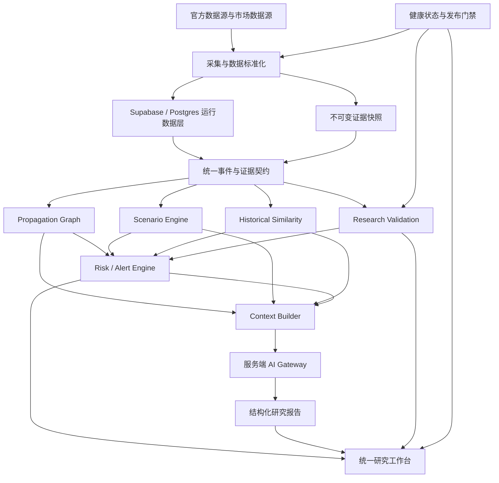

# financial-alert-system 当前架构演进规划 V1.1

> [!summary] 文档定位
> 本文是当前项目的架构演进基准，不代表项目已经发布或研究有效性已经通过。
> 当前正式状态仍以 [[AI项目控制台/financial-alert-system/任务进度|任务进度]]、`project_status.json` 和验收登记为准。

正式源码：`F:\financial-alert-system`  
规划目标：将现有系统渐进式演进为“个人 AI 宏观研究操作系统”  
核心原则：证据优先、规则定责、AI 辅助、研究可复现、架构渐进拆分

关联主线：

- [[AI项目控制台/financial-alert-system/01_项目治理/02_工程与文档/项目收缩与核心闭环整改计划_2026-07-16|项目收缩与核心闭环整改计划]]
- [[AI项目控制台/financial-alert-system/01_项目治理/02_工程与文档/NFP真实盲测执行计划_2026-07-17|NFP 真实盲测执行计划]]
- [[AI项目控制台/financial-alert-system/01_项目治理/02_工程与文档/远程采集面_Supabase_2026-07-17|远程采集面 Supabase]]

---

## 一、总体判断

项目不需要重新创建一个平行的 `financial-alert-system-v2`，也不需要推倒重写。

当前已经具备：

- 传播图引擎；
- 场景推理引擎；
- Supabase/Postgres 远程数据层；
- 宏观—微观传导结构；
- NFP 独立研究应用；
- 官方宏观数据包；
- 研究冻结、结算、盲测和前瞻观察脚手架；
- 微观层领域、契约、适配器和测试结构。

当前真正需要解决的是：

1. 安全边界尚未完全闭合；
2. 研究有效性仍处于 `BLOCK`；
3. 浏览器承担了过多业务和 AI 调用逻辑；
4. 领域契约尚未全局统一；
5. 图谱、场景、研究证据仍散落在大型脚本中；
6. 数据存储职责需要明确；
7. 工程通过与研究可信尚未统一到同一套发布门禁。

因此，架构路线应当是：

> 保留现有功能 → 建立统一契约 → 收紧后端边界 → 抽离领域引擎 → 完成研究验证 → 增加相似度与风险评分 → 最后建设 AI Analyst。

---

## 二、产品边界

### 2.1 产品定位

系统定位为：

> Evidence-driven Macro Research OS  
> 证据驱动的个人宏观研究操作系统

系统负责：

- 收集宏观和市场数据；
- 识别宏观事件；
- 建立传导路径；
- 生成情景假设；
- 监控路径确认或失效；
- 寻找历史相似案例；
- 计算可解释风险；
- 生成有来源的研究报告。

系统暂不负责：

- 自动交易；
- 自动下单；
- 无人工审核的投资建议；
- 由大模型直接修改知识图谱；
- 由大模型直接决定研究是否通过；
- 多租户商业 SaaS。

---

## 三、目标架构



基本责任关系：

- 数据层负责“事实是什么”；
- 图谱负责“可能如何传导”；
- 场景引擎负责“有哪些可能路径”；
- 相似度引擎负责“过去发生过什么”；
- 风险引擎负责“当前应关注什么”；
- 研究门禁负责“结论是否可信”；
- AI 负责“把已有证据组织成可读解释”。

AI 不成为事实来源，也不拥有最终裁决权。

---

## 四、建议目录结构

```text
financial-alert-system/
│
├── apps/
│   ├── api/                         # 统一后端入口
│   ├── workbench/                   # 统一研究工作台
│   ├── collector-worker/            # 远程采集任务
│   └── nfp-research/                # 已有 NFP 独立应用
│
├── packages/
│   ├── contracts/                   # 全局领域契约
│   ├── official-macro-data/         # 已有官方宏观数据包
│   ├── market-data/                 # 市场数据标准化
│   ├── evidence-domain/             # 证据、来源、新鲜度
│   ├── graph-domain/                # 传播图领域引擎
│   ├── scenario-domain/             # 场景推理引擎
│   ├── similarity-domain/           # 历史相似度
│   ├── risk-domain/                 # 风险与预警评分
│   ├── research-domain/             # 冻结、盲测、结算
│   ├── micro-domain/                # 微观传导领域
│   ├── ai-gateway/                  # 服务端模型适配器
│   ├── repositories/                # 数据库和文件适配器
│   └── observability/               # 状态、日志、指标
│
├── supabase/
│   └── migrations/
├── knowledge/
│   ├── taxonomy/
│   ├── graph/
│   ├── scenarios/
│   └── historical-cases/
├── artifacts/                       # 不可变执行和验收产物
├── scripts/                         # 运维与迁移脚本
├── docs/
│   ├── architecture/
│   ├── adr/                         # 架构决策记录
│   └── research-protocols/
└── static/                          # 迁移期遗留界面，逐步缩减
```

迁移期间保留现有 `static/` 和 `local_server.js`，使用兼容适配器连接新模块。只有对应能力迁移并验收后，才删除旧实现。

---

## 五、统一领域契约

### 5.1 MacroEvent

```text
event_id
event_type
scheduled_at
released_at
as_of
actual
consensus
previous
revision
surprise_value
surprise_score
source_id
source_url
captured_at
data_quality
schema_version
```

### 5.2 Evidence

```text
evidence_id
subject_type
subject_id
evidence_role
source_id
source_url
observed_at
captured_at
valid_from
freshness_status
quality_score
content_hash
snapshot_uri
```

证据角色固定为：

- `native`：官方或原生数据；
- `proxy`：替代指标；
- `synthetic`：模拟或测试数据；
- `narrative`：新闻、评论和解释性材料。

`synthetic` 不得获得正式研究信用。

### 5.3 GraphEdge

```text
edge_id
source_node
target_node
mechanism
direction
expected_lag
regime_conditions
invalidation_conditions
confidence_prior
evidence_ids
graph_version
```

### 5.4 Scenario

```text
scenario_id
event_id
snapshot_id
regime
assumptions
candidate_paths
path_probabilities
confirmation_signals
invalidation_signals
created_at
engine_version
```

### 5.5 Alert

Alert 不保存单一黑箱分数，而保存以下分项：

```text
severity
probability
evidence_quality
portfolio_exposure
freshness
uncertainty_penalty
final_score
score_version
explanation
```

推荐公式：

```text
最终风险 =
严重度 × 发生概率 × 证据质量 × 暴露程度 × 新鲜度
－ 不确定性惩罚
```

---

## 六、数据架构

### 6.1 Supabase/Postgres

继续作为运行数据源，承担采集状态、宏观事件、市场观测、数据源健康、微观观测、场景运行、风险预警、研究试验和报告元数据。

建议逐步增加：

```text
source_snapshots
macro_events
event_revisions
market_observations
graph_versions
path_evidence
scenario_runs
similarity_runs
risk_assessments
alerts
research_trials
research_outcomes
report_runs
```

### 6.2 JSON

继续用于图谱源文件、Taxonomy、Schema、测试夹具、冻结研究卡、验收产物和可复现快照。JSON 不再承担长期时间序列查询和运行状态管理。

### 6.3 DuckDB

暂不作为首要任务。只在大批量历史回测、本地多表分析明显变慢、需要离线分析大量 Parquet，或历史相似度特征计算确有性能需求时引入。

> Supabase/Postgres 是运行事实源；DuckDB 是派生分析仓库。

禁止两者同时成为同一业务对象的主数据源。

### 6.4 Obsidian

Obsidian承担架构规划、研究方法、决策记录、人工复盘和使用说明。Obsidian不是运行数据源，也不决定系统门禁状态。

---

## 七、AI 层规划

### 7.1 服务端 AI Gateway

所有模型调用必须迁移到服务端。浏览器只能提交研究任务类型、事件 ID、场景 ID 和报告模板。

服务端负责读取模型密钥、构建上下文、限制数据范围、执行模型调用、校验结构化输出、保存调用记录和返回脱敏结果。

当前发现浏览器侧仍有模型直连和硬编码凭据遗留，应立即轮换相关密钥，并清理代码、构建产物和必要的历史记录。

### 7.2 Context Pack

每次调用生成固定上下文包：

```text
event
evidence
market_snapshot
graph_paths
scenarios
historical_cases
risk_components
data_quality
known_unknowns
```

同时保存：

```text
context_hash
prompt_version
model
model_parameters
generated_at
output_schema_version
```

### 7.3 AI 权限限制

AI 可以总结证据、解释传导路径、生成备选情景、生成报告和标记证据冲突。

AI 不可以修改原始事件、自动提高证据等级、自动恢复失效路径、绕过研究门禁、直接发布交易建议，或把模型推测写成已验证事实。

---

## 八、研究有效性架构

研究有效性必须独立于工程测试。

工程门禁验证 Schema、流程、文件、API 和数据库是否能正常工作。

研究门禁验证：

- 是否使用真实历史数据；
- 是否严格遵守 `as_of`；
- 是否存在未来数据泄漏；
- 是否预先冻结预测；
- 是否有结算结果；
- 是否达到最低样本数；
- 是否保存可复现的失败案例。

最低目标：

- 真实历史盲测不少于 20 个事件；
- 真实前瞻观察不少于 3 个事件；
- 所有正式样本必须具备冻结时间、证据快照和结算结果；
- 模拟样本不能计入研究通过数量。

前瞻事件依赖真实日历时间，是不可压缩环节。开发可以并行，但不能用模拟事件替代真实前瞻验证。

---

## 九、分阶段实施路线

> [!note] 阶段编号
> 为避免与既有微观层 S0/S3 混淆，本方案统一使用 `AR-S0～AR-S6`。

### AR-S0：安全封口与基线冻结

预计：2～4天；必须最先完成。

任务：

1. 轮换已经暴露或硬编码的模型凭据；
2. 删除浏览器侧硬编码密钥；
3. 检查 Git 历史和构建产物；
4. 冻结当前架构、测试和图谱基线；
5. 清理临时目录与未归档文件；
6. 建立架构决策记录；
7. 明确正式源码、文档和运行事实源。

验收：

- 浏览器代码中不存在有效密钥；
- 安全扫描为零泄漏；
- 工程基线可重复运行；
- 工作区变更已分类；
- `project_status.json` 能反映真实状态。

### AR-S1：统一契约与数据治理

预计：1～2周；依赖 AR-S0。

任务：建立 `packages/contracts`；统一 Event、Evidence、Observation、Scenario、Alert；补充 `as_of`、版本、来源和哈希；建立 Repository；增加 Supabase 迁移；建立数据新鲜度和降级状态；为旧 JSON 提供兼容适配器。

验收：所有正式研究对象使用统一 ID；事件和证据必填字段覆盖率 100%；重复采集幂等；旧界面仍可运行；陈旧数据明确显示降级。

### AR-S2：后端边界与 AI 服务端化

预计：1～2周；依赖 AR-S1 契约冻结。

任务：将 `local_server.js` 收口为兼容 BFF；建立 `apps/api`；迁移模型调用、翻译和外部数据代理；建立统一错误码和请求日志；提供版本化 API；禁止浏览器直连模型服务。

建议接口：

```text
/api/v1/health
/api/v1/events
/api/v1/evidence
/api/v1/graph/paths
/api/v1/scenarios
/api/v1/similarity
/api/v1/alerts
/api/v1/reports
/api/v1/research/runs
```

验收：100% 模型调用经过服务端；前端不再持有供应商密钥；API 输出通过 Schema 校验；旧界面通过兼容层保持可用。

### AR-S3：现有领域引擎抽离

预计：2～3周；依赖 AR-S1，可与 AR-S2 后半程并行。

任务：将 Propagation Engine 抽入 `graph-domain`；将 Scenario Reasoner 抽入 `scenario-domain`；微观能力逐步迁入 `micro-domain`；分离 UI 与领域计算；建立新旧结果对照测试；增加图谱、路径和推理版本。

验收：同一输入下新旧核心路径结果一致；引擎可脱离浏览器独立运行；引擎不直接读写 UI；图谱修改可回滚；推理结果可追溯至证据和版本。

### AR-S4：研究验证与历史相似度

预计：2～4周工程时间；真实前瞻观察持续进行。

任务：完成至少 20 个真实历史盲测；持续登记真实前瞻事件；建立历史事件特征；开发 Historical Similarity Engine；输出相似与差异原因；防止按最终结果事后匹配。

相似度维度：

```text
通胀环境
增长状态
利率水平
美元趋势
波动率
流动性
政策阶段
事件 surprise
市场初始反应
传导路径结构
```

验收：结果能够解释“为什么相似”；所有历史特征遵守当时 `as_of`；不得引用未来修订数据；研究门禁与工程门禁分别展示。

### AR-S5：可解释预警与 AI Analyst

预计：2周；依赖 AR-S2、AR-S3 和 AR-S4 的可信数据。

任务：建立分项 Alert Score；增加市场状态识别、持仓暴露、每日宏观简报、证据冲突、路径失效提示和 AI 报告评估集。

验收：风险分数可以展开查看组成；AI 报告包含证据、未知项和失效条件；不得生成无来源的确定性结论；无模型服务时仍能输出规则版报告。

### AR-S6：发布与运行治理

预计：1～2周；依赖前述工程门禁通过。

任务：建立采集监控、数据库备份恢复、错误告警、发布回滚、版本标记、只读与管理权限，并完成连续运行观察。

验收：连续7天采集成功率达到约定标准；数据源失效不会静默；一键回滚和数据库恢复演练通过；研究未通过时不得显示“研究已验证”；发布门禁由统一状态生成器判定。

---

## 十、并行开发机制

### 第一并行波：AR-S0

可同时进行：

- A线：密钥轮换与安全清理；
- B线：领域契约设计；
- C线：历史盲测协议设计；
- D线：大型前端脚本依赖盘点。

必须串行：

1. 密钥先轮换，再继续 AI 接口开发；
2. 契约冻结后，才能正式创建数据库迁移。

### 第二并行波：AR-S1～AR-S3

可同时进行：

- A线：Supabase Schema 和 Repository；
- B线：API 与 AI Gateway；
- C线：Graph Engine 抽离；
- D线：Scenario Engine 抽离；
- E线：历史证据整理；
- F线：前端兼容适配器。

共同检查点：Event、Evidence、Scenario 契约必须一致。

### 第三并行波：AR-S4～AR-S5

可同时进行：

- A线：真实历史盲测；
- B线：真实前瞻事件持续观察；
- C线：Historical Similarity；
- D线：Risk/Alert Engine；
- E线：研究工作台重构；
- F线：AI 报告评估。

必须串行：

1. 可信历史特征库完成后，才能正式验收相似度；
2. Graph 和 Scenario 输出稳定后，才能冻结 Alert Score；
3. AI Gateway 完成后，才能上线 AI Analyst；
4. 研究门禁通过后，才能对外宣称研究有效。

---

## 十一、建议时间表

| 周期 | 主要阶段 | 并行工作 |
|---|---|---|
| 第1周 | AR-S0 | 安全、契约草案、研究协议、依赖盘点 |
| 第2～3周 | AR-S1、AR-S2 | 数据库、API、AI Gateway、历史数据整理 |
| 第3～5周 | AR-S3 | Graph、Scenario、Micro 领域抽离 |
| 第4～7周 | AR-S4 | 盲测、相似度、前瞻观察 |
| 第6～8周 | AR-S5 | 预警评分、工作台、AI Analyst |
| 第9～10周 | AR-S6 | 监控、恢复、发布门禁 |

工程架构收口预计约 8～10 周。

真实研究门禁不完全受工程周期控制。若坚持使用 NFP 单一月度事件完成三次前瞻观察，至少需要三个真实事件周期；可以增加 CPI、FOMC 等独立研究线，但不能把不同事件混为同一个统计样本。

---

## 十二、暂缓项目

以下项目暂不进入前四个阶段：

- 全面改写前端框架；
- 引入图数据库；
- DuckDB 全面替代现有数据层；
- 多用户系统；
- 自动交易；
- 长期 Agent Memory；
- 多模型自动辩论；
- “个人 Bloomberg”式全资产覆盖。

只有当前核心研究闭环被证明有效后，才扩大覆盖范围。

---

## 十三、最终验收标准

### 工程

- 领域计算可以脱离浏览器运行；
- 前端不保存供应商密钥；
- API、数据和推理均有版本；
- 数据采集、降级和恢复可观察；
- 旧功能完成兼容迁移。

### 数据

- 每条正式证据拥有来源、时间和哈希；
- 每次研究都能恢复当时的数据快照；
- 运行数据与研究产物职责清楚；
- 不存在模糊的双主数据源。

### 研究

- 不少于20个真实历史盲测；
- 不少于3个真实前瞻事件；
- 无未来数据泄漏；
- 失败案例同样被保存；
- 模拟数据不获得研究信用。

### AI

- AI 只通过服务端调用；
- 输出通过结构化 Schema；
- 报告包含来源、未知项和失效条件；
- 规则引擎可在无 AI 情况下独立运行。

### 发布

- 安全、工程、数据新鲜度和研究门禁分别判定；
- 任一关键门禁阻断时，系统不得宣称正式发布；
- 支持回滚、备份和恢复演练。

---

## 十四、当前第一行动项

下一步不直接扩张新功能，而应执行：

> AR-S0：安全封口、源码基线冻结、统一契约草案和研究协议冻结。

AR-S0 完成以后，项目才能进入真正可控的多线并行开发。

返回 [[AI项目控制台/financial-alert-system/01_项目治理/00_项目治理索引|项目治理索引]] · [[AI项目控制台/financial-alert-system/00_🟠索引|项目导航]]
